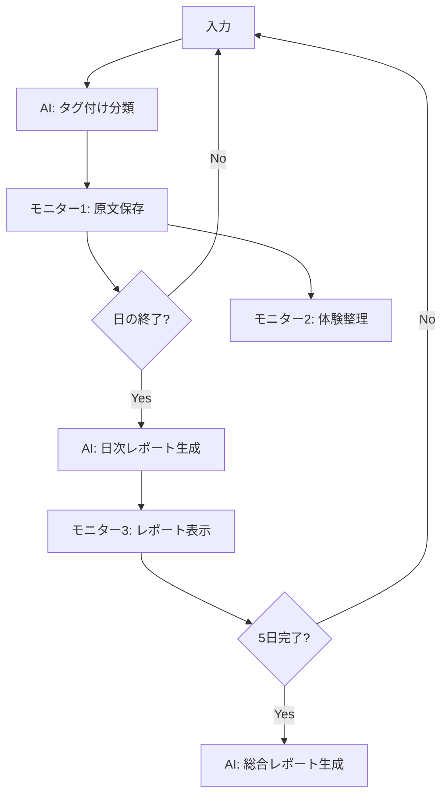

# MULTAs v2 アーキテクチャ設計書

## 🎯 設計コンセプト
現在の安定したv1基盤を維持しながら、AI活用を3つのポイントに絞り、モニター切り替えで段階的な情報整理を実現

## 🤖 AI活用の3つのポイント

### 1. 入力直後のタグ付け（分類）
- **タイミング**: 記録ボタン押下直後
- **処理内容**: 8項目医学実習カテゴリへの自動分類
- **AI使用量**: 最小限（短文分類のみ）
- **目的**: 体験の即座の整理

### 2. 日毎レポート生成（再構成）
- **タイミング**: その日の入力終了時（クローズボタン）
- **処理内容**: 1日分の記録を構造化レポートに変換
- **AI使用量**: 中程度（まとめて処理）
- **目的**: 日次の学習振り返り

### 3. 5日間総合レポート（統合）
- **タイミング**: 5日目完了後
- **処理内容**: 全記録から総合的な実習レポート生成
- **AI使用量**: 大（全体分析）
- **目的**: 実習全体の総括

## 📊 3つのモニター設計

### モニター1: 時系列原文蓄積（現状維持）
```
機能：
- 入力したままの原文を時系列表示
- 編集・削除機能
- タグ（カテゴリ）表示
- 現在のv1をそのまま活用
```

### モニター2: 体験整理表示
```
機能：
- カテゴリ別グループ表示
- 各カテゴリの記録数・割合
- 重要な学びのハイライト
- タグが正確ならルールベースでも可
```

### モニター3: レポート表示・ダウンロード
```
機能：
- 日次レポート表示
- 5日間総合レポート
- PDF/Word形式でダウンロード
- 提出用フォーマット対応
```

## 🔄 処理フロー



## 💡 実装の優先順位

### Phase 1（現在）
- ✅ モニター1: 基本機能完成
- 🔄 AI処理①: 入力直後のタグ付け

### Phase 2
- モニター切り替えUI
- モニター2: 体験整理表示
- カテゴリ別集計機能

### Phase 3
- AI処理②: 日次レポート生成
- モニター3: レポート表示
- 基本的なダウンロード機能

### Phase 4
- AI処理③: 5日間総合レポート
- 高度なフォーマット対応
- 提出用テンプレート

## 🎨 UI設計案

```
┌─────────────────────────────────────┐
│  🎯 MULTAs シンプル版 v2            │
│  [モニター1] [モニター2] [モニター3] │
├─────────────────────────────────────┤
│                                     │
│    現在選択中のモニター表示          │
│                                     │
├─────────────────────────────────────┤
│  入力エリア                         │
│  [📝 記録] [📅 日を終了]            │
└─────────────────────────────────────┘
```

## 🚀 期待される効果

1. **即座の整理**: タグ付けで体験が自動分類
2. **段階的な深化**: 原文→整理→レポートの3段階
3. **柔軟な活用**: 必要に応じてモニター切り替え
4. **コスト効率**: AI使用を必要最小限に
5. **確実な動作**: 基盤のv1は安定稼働を維持

この設計により、シンプルさを保ちながら高度な機能を実現できます。